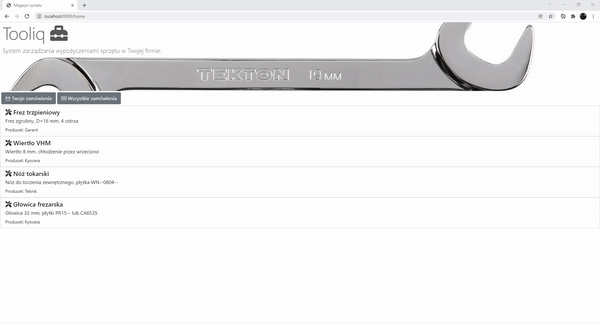

# Tooliq
> Your own system to manage tools in your company!
> 

## Table of Contents
* [General Info](#general-information)
* [Technologies Used](#technologies-used)
* [Features](#features)
* [Screenshots](#screenshots)
* [Setup](#setup)
* [Project Status](#project-status)
* [Room for Improvement](#room-for-improvement)
* [Acknowledgements](#acknowledgements)
* [Contact](#contact)

## General Information
- Tooliq helps control tools order inside company.
- Shows who and what tools he borrowed.
- Helps you to manage with orders in dedicated panel.

## Technologies Used
- Java - version 17
- Spring - version 5.3.14
- H2 Database - version 1.4.2
- Thymeleaf - version 3.0.14
- Bootstrap - version 5.1.3
- HTML5
- CSS

## Features

- Create your cart with tools to borrow.
- Send order with your name and department you work in.
- Check list of all orders, sort by status and edit.
- Manage all orders changing their status from "new" to "in progress" to final "complete".

## Screenshots

## Setup
To open project you need instal Java 17, Apache Tomcat 9.0.56, download .jar file and run application
with Spring Boot configuration. All dependenies are in pom.xml file.

## Project Status
Project is: _in progress_. 

## Room for Improvement
There's massive amount space to improve this project, the most valuable is:

- Create panel to adding new tools.
- Create mail service to obtain message every time your order change status.
- Add API. 

## Acknowledgements

- This project was inspired by one of exercise in javastart.pl courses.
- Thanks for README.md template to [@flynerdpl](https://www.flynerd.pl/)

## Contact
I'm on  [Linkedin](https://www.linkedin.com/in/grzegorz-dziedzicki) - feel free to contact me!

